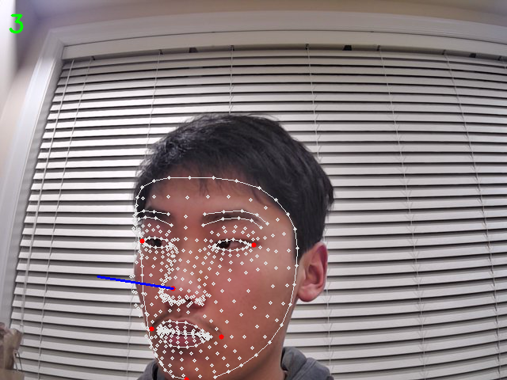

# levelhead
(currently under work) a basketball trainer based on computer vision

  

Levelhead uses computer vision to determine the angle a person's head is facing. If the user's head is tilted too high or low, Levelhead gives an aural and visual alert to keep their head level. So far this is literally just a program that detects when your head is not perfectly level to the camera (sadge)

OpenCV and mediapipe were first used to place facial landmarks on a user's head. Specific landmarks and their respective locations were then picked and passed through a Perspective and Point formula to determine the direction the user is facing. Next, a personally developed formula was used to determine the vertical component angle of the person's head. If facing too high/low, visual cues from OpenCV and audio cues from Playsound were used to tell the user to keep their head level while practicing.

   
  
   
  the inner workings of levelhead; the image above shows:

  &nbsp; &nbsp; &nbsp; &nbsp; <code> - face mesh created from mediapipe are shown with the white dots </code>  
  &nbsp; &nbsp; &nbsp; &nbsp; <code> - points used in the point-to-perspective formula are shown as red dots </code>  
  &nbsp; &nbsp; &nbsp; &nbsp; <code> - perspective vector is shown with the blue line </code>  
  &nbsp; &nbsp; &nbsp; &nbsp; <code> - the vertical angle is shown with the green text in the top left </code>

